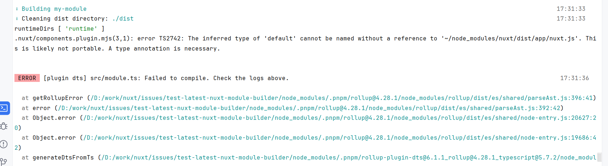

# @nuxt/module-builder failing with latest Rollup 4.28.1

Using Rollup 4.28.1 and TypeScript 5.7.2 cannot build the Nuxt module. It looks like we have some side effect issues with the latest Rollup 4.28.1 and Vite 6:

Using Rollup 4.28.0 and TypeScript 5.7.2 works (remove Vite 6 and use Rollup 4.28.0 in `pnpm.overrides` entry).
